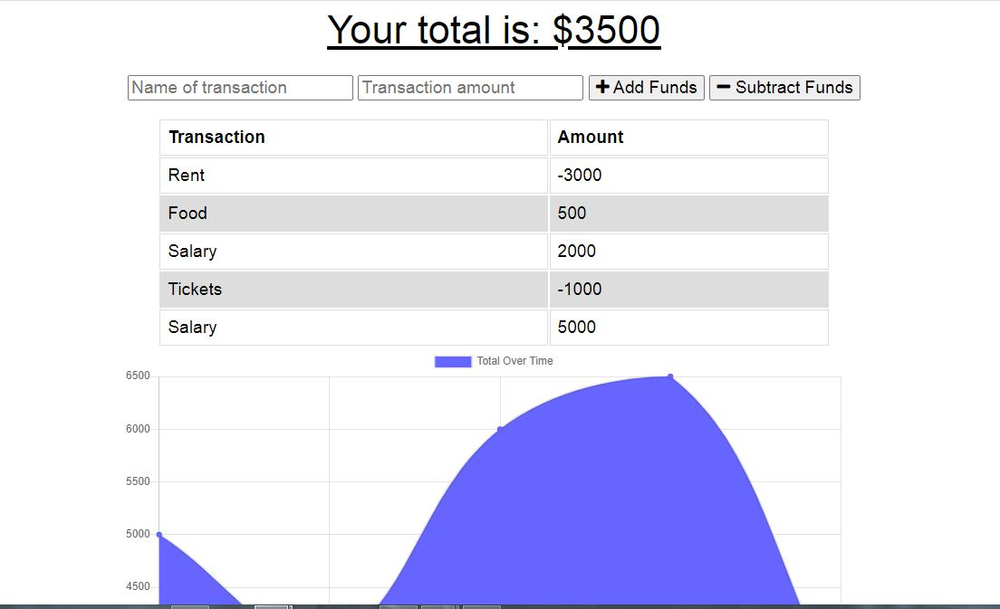

# Budget Tracker 

## Contents
* [Description](#Description)
* [User Story](#User-Story)
* [Acceptance Criteria](#Acceptance-Criteria)
* [Usage](#Usage)
* [Features](#Features)
* [Installation](#Installation)
* [Apllication](#Application)


### Description
This is budget tracker application to allow for offline access and functionality. The user will be able to add expenses and deposits to their budget with or without a connection. If the user enters transactions offline, the total should be updated when they're brought back online.




### User Story

```
AS AN avid traveler
I WANT to be able to track my withdrawals and deposits with or without a data/internet connection
SO THAT my account balance is accurate when I am traveling 
```

### Acceptance Criteria

```
GIVEN a budget tracker without an internet connection
WHEN the user inputs an expense or deposit
THEN they will receive a notification that they have added an expense or deposit
WHEN the user reestablishes an internet connection
THEN the deposits or expenses added while they were offline are added to their transaction history and their totals are updated
```
### Usage 
Privide name of transaction in first input field "Name of transaction", enter amount in next input field "transaction amount". Then, you need to decide it is your funds (+ Add funds button) or expences (- Subtract funds button). 

### Features
- HTML
- CSS
- JavaScript
- Compression
- Express.js
- Mongoose
- Morgan
- MongoDB

### Installation
- npm init
- npm i compression
- npm i express
- npm install mongoose --save
- npm i morgan

### Application

- deployed link to heroku => https://evening-oasis-49511.herokuapp.com